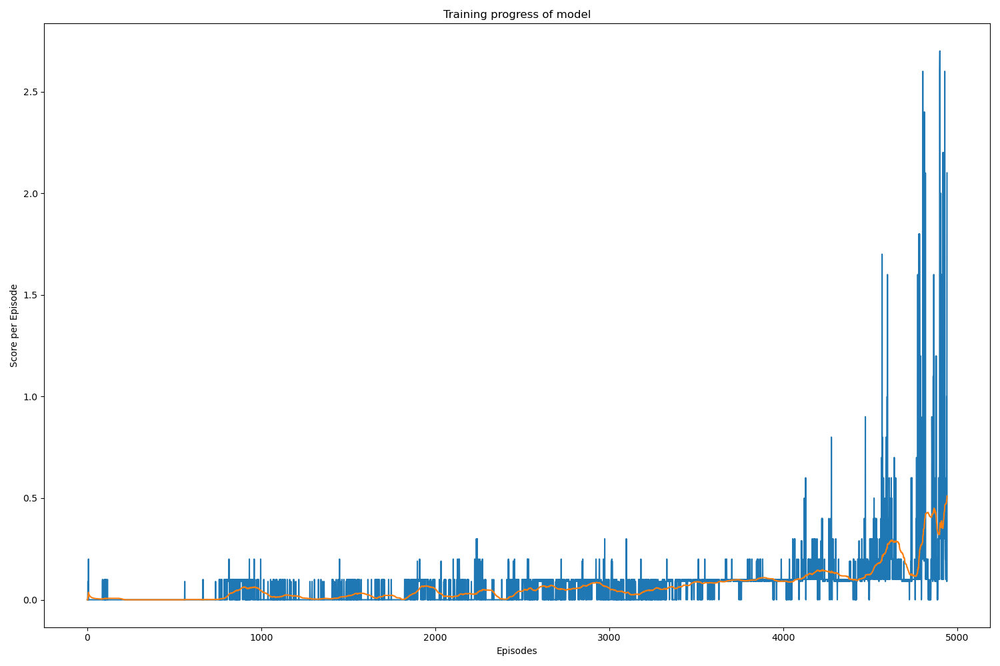
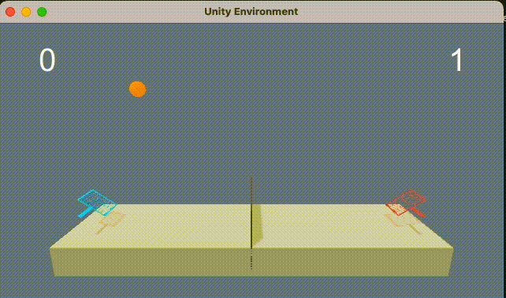

# Udacity RL course: Project 3 - Report

## Learning algorithm
The training algorithm is roughly structure as follows:
- The environment is initialized and the initial state is obtained
- The state is passed to the agens, which return the actions
- These actions are passed to the environment, which will respond with a new state, a reward and a flag indicating if the episode is finished or not
- This tuple (new state, reward, done) is passed to the agents so it can update it's learning process.
- The learning process uses the Deep Deterministic Policy Gradient (DDPG), an algorithm which concurrently learns a Q-function and a policy.
- The new state is passed to the agent, restarting the loop.

The actor and critic are modeled using a Neural Network with 3 hidden dense layers and 2 Batch Normalization layers. 

The parameters used in the DDPG algorithm are as follows (might be slightly different on final version):
```
BUFFER_SIZE = int(2e6)  # replay buffer size
BATCH_SIZE = 128  # minibatch size
GAMMA = 0.99  # discount factor
TAU = 0.001  # for soft update of target parameters
LR_ACTOR = 0.0002  # learning rate of the actor
LR_CRITIC = 0.0002  # learning rate of the critic
WEIGHT_DECAY = 0.00001  # L2 weight decay
```
The parameters were either kept constant (taken from the example project [DDPG Bipedal](https://github.com/udacity/deep-reinforcement-learning/tree/master/ddpg-bipedal)) or fine tuned via trial and error.

## Results
The agent was capable to achieve an average score of >0.5 after approximatly ~5000 episodes, however the convergence varied from run to run and the average score doesn't necessarily keep increasing with further training.

Slight changes to the hyperparameters often led to non-convergence event after 20k+ episodes.

```
# Run the training job.
# This might take a while!
scores, avg_scores = ma_ddpg(n_episodes=6000, print_every=1000, early_stop=False)

Episode 1000	Average Score: 0.00
Episode 2000	Average Score: 0.01
Episode 3000	Average Score: 0.00
Episode 4000	Average Score: 0.00
Episode 5000	Average Score: 0.51
Episode 6000	Average Score: 0.90
Environment solved in 4939 episodes!	Average Score: 0.51

```



Visual inspection of the agent behavior in the environment confirms that it acts as expected


## Future work
- Optimizing hyperparameters.
- Testing different Neural Network architectures.
- Testing different multi-agent algorithms
